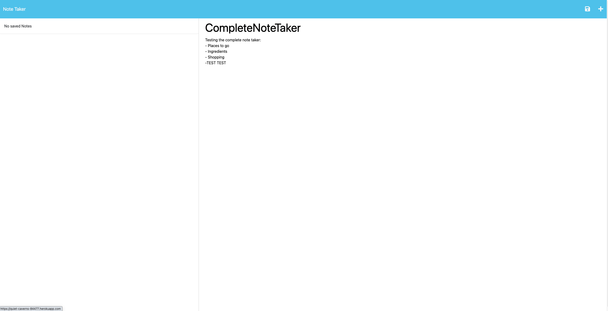

# CompleteNoteTaker

## Description

This CompleteNoteTaker was built based on the idea that notes can be shared. By utilising Express.js and Node.js, Deployed through Heroku, we are able to create a complete note taker that can be shared around. Future improvements would be able to choose between using an independent local storage note taker and a databased note taker all in one website. 

## Usage

To use this note taker, simply click on the deployed link below, click on the "get started" button and start taking notes! Add text into the "note title" and "note text" sections and click the save button on the top right, hit the plus button to add a new note. Clicking on the saved notes on the left will bring up your saved notes. To delete the notes, simply hit the rubbish button next to the saved notes

[Deployed Link](https://quiet-caverns-84477.herokuapp.com/)

